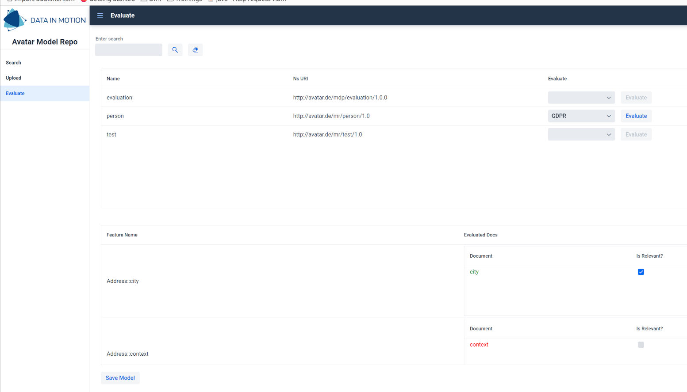
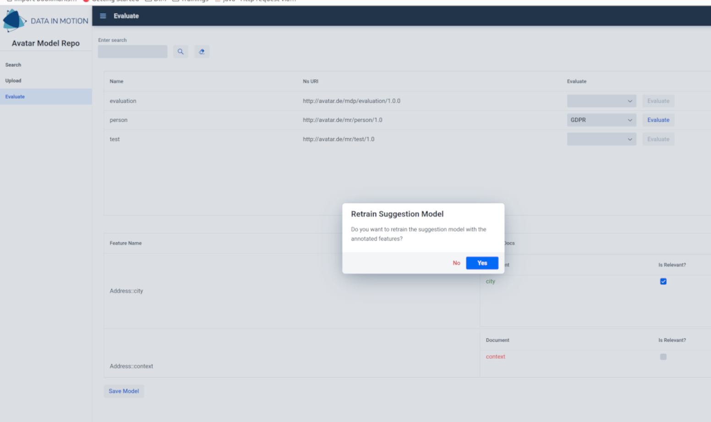

---
pandoc-latex-environment:
  center: [center]

---

# Model Suggester First Implementation

## Introduction

### Where we stand

+ From our previous studies about text classification, we decided to go with a model based on the cosine distance and the gloVe vectorization;
+ Input text is vectorized according to gloVe 50D pre-trained model;
+ The text category is determined by computing the minimal cosine distance from a set of trained words and determining whether it is below a certain threshold or not.

### What we need

+ A service which takes as input as `EPackage` and evaluates all the features' names and possible descriptions according to our model;
+ A model to display the result of the analysis;
+ A simple UI to display the results and trigger the whole process;
+ A second service that is responsible for retraining our suggester when the user has made changes on the suggested results.

## The Model Evaluator Service

### The Model Evaluator Service

\lstset{language=java, style=code-inline}

+ I built an API `ModelEvaluatorService` which provides just one method:

  \lstset{language=java, style=outside-block}

  ```java
  EvaluationSummary evaluateModel(EPackage ePackage);
  ```

  \lstset{language=java, style=code-inline}

+ The `EvaluationSummary`is an `EObject` of a new model I created;

+ The first implementation of the `ModelEvaluatorService` evaluates the model based on GDPR privacy related terms;

+ Additional implementations can then be added for other sets of regulations (OpenData, etc.).

## The `Evaluation` Model

### The `Evaluation` Model

\includegraphics[scale=0.3]{./images/EvaluationModel.png}

## The UI

### The UI

\lstset{language=java, style=code-inline}

+ I built a simple Vaadin view, in which you can search for a model in the system (which are registered through the `DynamicPackageLoader`) and trigger an evaluation;
+ The `EvaluationSummary` is then displayed in a table, in which terms that are found relevant are marked in green, while terms that are found non relevant are shown in red;
+ The user has then the possibility to change the result for each term.

### The UI



### The UI

+ When the user saves the changes, the creation of the coupled model with the information on the evaluation should be triggered;
+ This part **has not been implemented yet**;
+ When the user saves the changes, he/she can also trigger a retraining of the suggestion model, based on such changes;
+ This will pass the list of evaluated documents to a dedicated service which will then add them to the suggestion model and recomputes the threshold for the determination of a document category.

### The UI



## The Suggester Retrainer Service

### The Suggester Retrainer Service

\lstset{language=java, style=code-inline}

+ A second API, `ModelSuggesterRetrainerService` has been cretaed;

+ It contains a method to trigger the retraining of the suggerster:

  \lstset{language=java, style=outside-block}

  ```java
  void retrainModelSuggester(List<String> pertinentDocs, List<String> unrelevantDocs);
  ```

+ I have implemented such API for the GDPR standards, triggering the retraining of the model;

+ Additional implementations can then be added for other sets of regulations (OpenData, etc.).

### The Retraining Mechanism

When the suggester model is retrained:

+ The relevant documents are added to both the test and train set (if duplicated docs are present, the old ones are removed);
+ The non-relevant documents are added to the test set;
+ The documents of both train and sets are then cleaned, tokenized and vectorized again;
+ The minimal cosine distance between each test document and the train set is computed;
+ A new optimal threshold is determined based on the accuracy of the selection given a certain value of threshold;
+ The new parameters and the new sets are saved in a file for further use.

## Next Steps

### Next Steps

+ We could in principle also add the One-Class SVM model as possibility for the suggester, and see over time which one seems to perform better;
+ This is something we have to monitor when someone actually starts using it;
+ We have to think how we want to build the coupled model when a model has been evaluated.