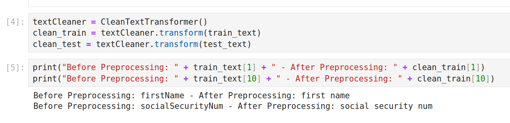
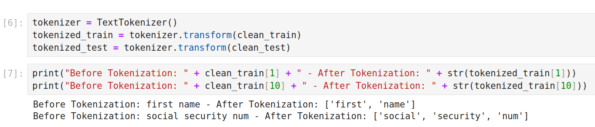
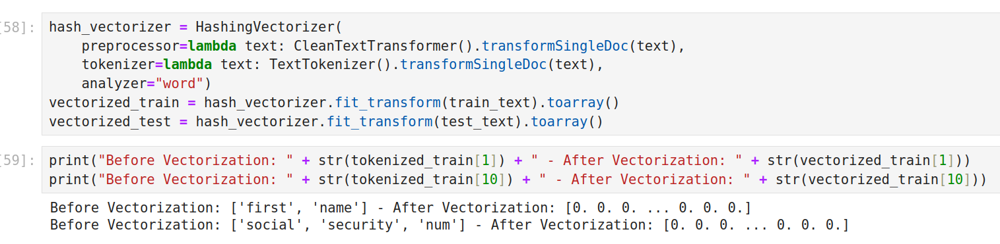
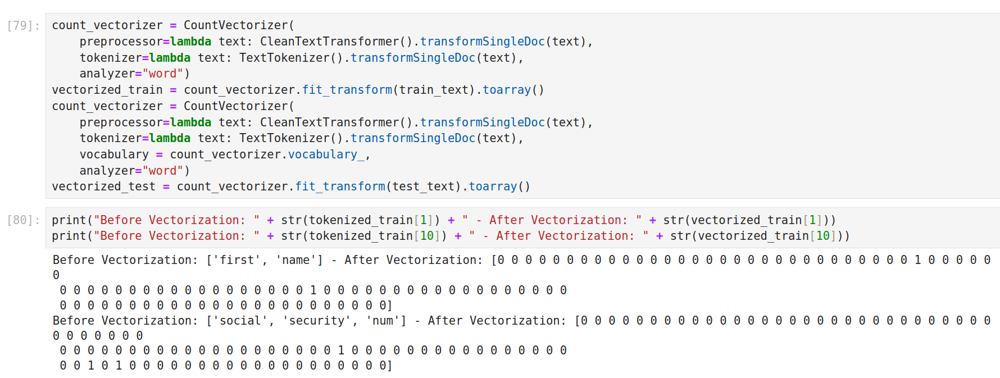
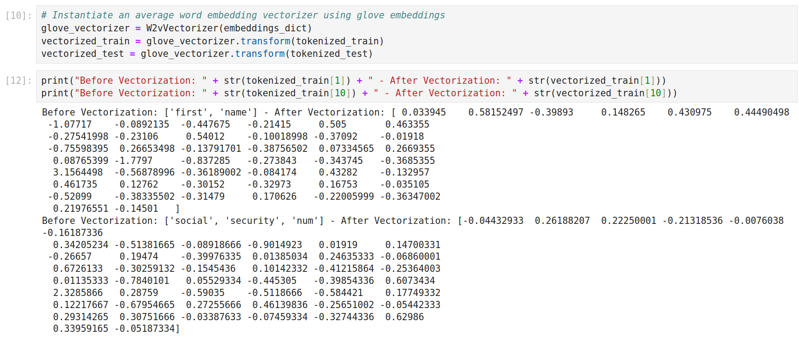
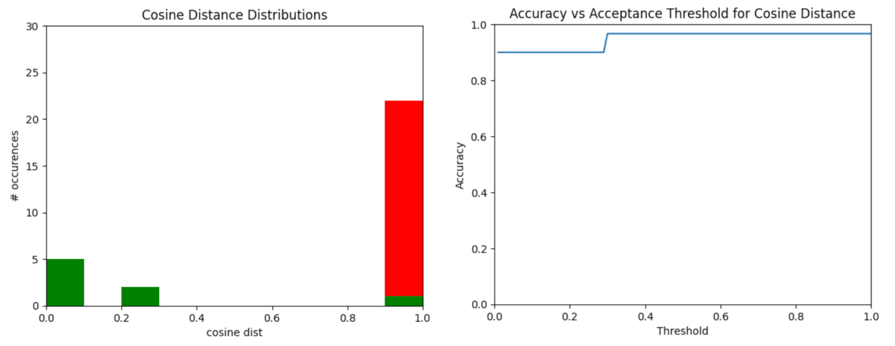
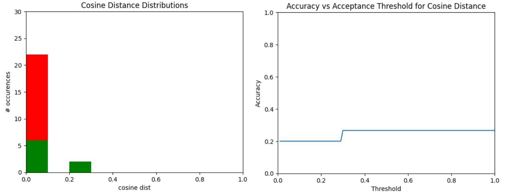
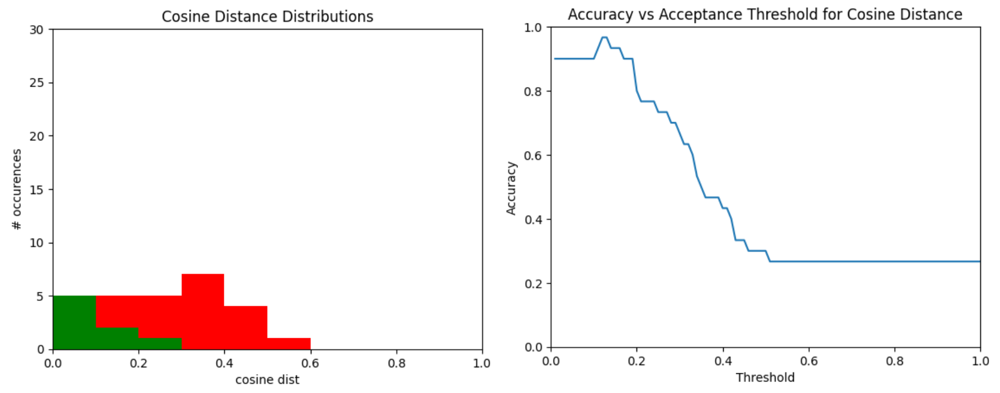

---
pandoc-latex-environment:
  center: [center]

---

# Text Classification Studies

## Introduction

### Introduction

+ Our goal is to identify whether a certain field in a model may constitute a privacy concern under certain standards (e.g. GDPR);
+ The suggestions should be based either on the field name or on the field description;
+ We can see the problem as a [one-class text classification](https://www.kaggle.com/code/saikumar587/bbc-text-oneclass-classificaiton) problem, where our only class is the category of privacy-related terms, while all the other terms have to be identified as outliers;
+ We can then train a model on a set of terms which we consider privacy-related, and then test it over some other examples.

### Introduction

\lstset{language=java, style=code-inline}

There are, however, several steps that have to be considered and understood before setting up such a model:

+ **Preprocessing**: data has to be preprocessed before feeding a text classification model;
+ **Tokenization**: the input text has then to be tokenized, maning divided in a set of tokens, containing only the relevant words (e.g. eliminating the stop words);
+ **Vectorization**: this step consists in converting the text into a numerical representation, namely a vector, which is interpretable by the computer. 

### Introduction

Once we have figured the previous steps out, we can start building our model. Also for that we tried two approaches:

+ A One-Class Text Classifier algorithm, provided by the python library [scikit-learn](https://scikit-learn.org/stable/modules/generated/sklearn.svm.OneClassSVM.html);
+ A simpler but more "under our control" approach, based on the computation of the cosine distance between the vector representations of the input text.

Results are then provided in terms of overall model accuracy, precision and recall. 

## The Analysis

### Data Sample

\lstset{language=java, style=code-inline}

+ As first thing, we load our train and test data sets;
+ They consist of simple tables with a specified category (`IDENTITY` or `NO-RELATED` for privacy-related terms and non, respectively);
+ The train set only consists of terms belonging to the first category, as this will be a one-class text classification problem. The test set,  instead, contains both kinds of terms.

### Preprocessing

\lstset{language=java, style=code-inline}

In this step we would need to pass from all the possible forms in which  our input text can be presented to a uniform and coherent form:

+ Variable names have to be converted to "standard" text (e.g. `firstName` should become `first name`);
+ Special symbols, such as `-`, `*` have to be removed;
+ Words have to be lemmatized (e.g. `places` should become `place`).

### Preprocessing

### Tokenization

\lstset{language=java, style=code-inline}

+ Our data sample, after pre-processing, is just a list of strings, each string representing one document;
+  What we want to achieve, instead, is to have a list of word tokens for every document;
+ E.g. `["first name", "social security num"]` should become `[["first", "name"], ["social", "security", "number"]]`.

### Tokenization

### Vectorization

+ The vector of tokens has to be converted into a vector of numbers;
+ We would need some kind of representation of words into a numerical space;
+ Ideally, words that are similar or analogous to each other would have a similar numerical representation, meaning, the distance between their vectors should be smaller compared to the one between two unrelated words.

### Vectorization

There are different kinds of vectorization mechanisms, so we have to explore them a bit and to evaluate their performances for our use case. We have considered:

+ [*HashingVectorizer*](https://scikit-learn.org/stable/modules/generated/sklearn.feature_extraction.text.HashingVectorizer.html)
+ [*CountVectorizer*](https://scikit-learn.org/stable/modules/generated/sklearn.feature_extraction.text.CountVectorizer.html)
+ [*GloVe Embedding*](https://nlp.stanford.edu/pubs/glove.pdf)

### Hashing Vectorizer

### Count Vectorizer

### GloVe Embedding

## Model Evaluation

### Model Evaluation

+ We have built a model with all 3 of the vectorization procedures listed above;
+ The data was previously preprocessed and tokenized as described every time;
+ After vectorizing, we evaluated the performance of each procedure in two ways:
  + Cosine Distance between test and train sets;
  + One-Class Text Classification SVM model.

### Cosine Distance 

\lstset{language=java, style=code-inline}

+ For every document in the test set, we compute the minimum cosine distance between its vector representation and the ones of the documents in the training set;
+ We then plotted the distributions of such distances for test documents which belong to the `IDENTITY` category (in green) and those which belong to the `NO-RELATED` category (in red).
+ We then looped over 100 values of possible threshold, to find the optimal distance discriminator in order to optimize the accuracy of our model.

### One-Class Text Classification SVM

+ We built a One-Class SVM model using as input the preprocessed-tokenized-vectorized data;
+ This model has 2 hyperparameters to be set;
+ We looped over several values of these parameters, and took the ones that maximize the model accuracy;
+ We then tested the model over the test set and compute the accuracy matrix.

## Results

### Hashing Vectorizer - Cosine Distance

| Precision | Recall | Accuracy |
| :-------: | :----: | :------: |
|    1.0    | 0.875  |   0.97   |

### Hashing Vectorizer - OneClassSVM

| Precision | Recall | Accuracy |
| :-------: | :----: | :------: |
|    1.0    |  0.75  |   0.93   |

### Count Vectorizer - Cosine Distance

| Precision | Recall | Accuracy |
| :-------: | :----: | :------: |
|   0.27    |  1.0   |   0.27   |

### Count Vectorizer - OneClassSVM

| Precision | Recall | Accuracy |
| :-------: | :----: | :------: |
|   0.19    |  0.62  |   0.17   |

### GloVe Embedding - Cosine Distance

| Precision | Recall | Accuracy |
| :-------: | :----: | :------: |
|    1.0    | 0.875  |   0.97   |

### GloVe Embedding - OneClassSVM

| Precision | Recall | Accuracy |
| :-------: | :----: | :------: |
|    1.0    |  0.38  |   0.83   |

## Conclusions

### Conclusions

+ Cosine distance and OneClassSVM seems to perform in a similar way given the same vectorizer (which is a good indication we are doing something right);
+ I personally prefer to use a cosine distance approach because I know what I am doing, while the OneClassSVM is a bit less under control, due to the hidden layer;
+ The Count Vectorizer performs poorly, and this is probably due to the fact that it uses as vocabulary just the unique words found in the training set;
+ GloVe has a well pre-trained model and we can test it also in other dimensions (currently we are using a vectorization with 50 dimensions, but there are also in 100D and more);
+ Overall, I would go on with the GloVe approach and the cosine distance as model.

### Next Steps

+ Build a pipeline which takes as input the `EStructuralFeature` names and attribute descriptions and give back a suggestion based on such model on whether they might be privacy-related terms;
+ Test the pipeline with some real `ecore` files;
+ Provide a small UI to easily test everything;
+ Provide the possibility to retrain the model when a new attribute which was not identified correctly is marked by the user.